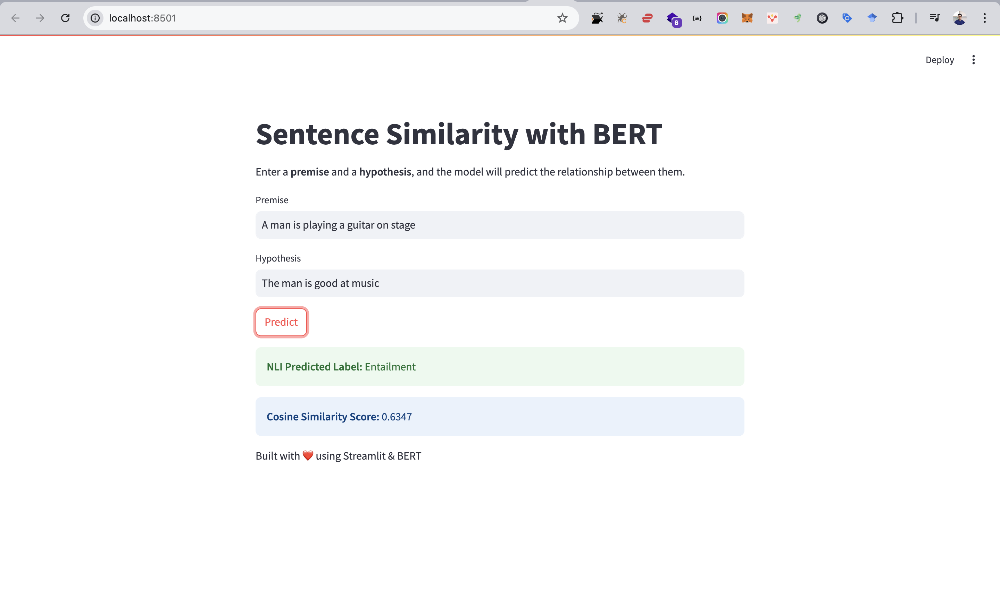
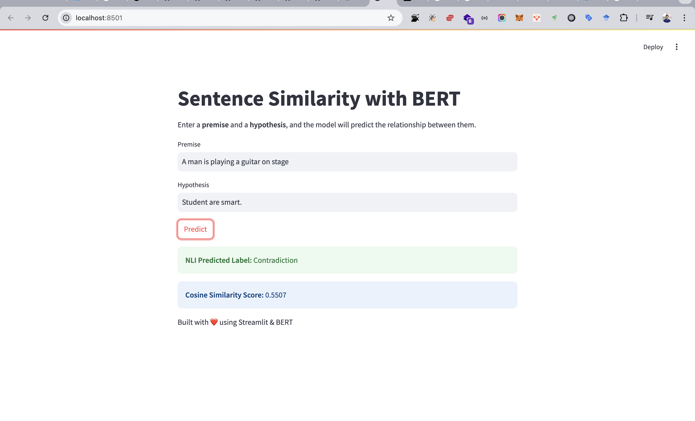
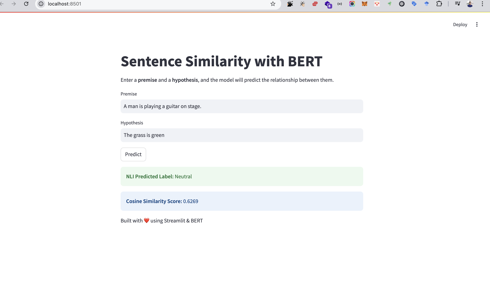

# NLP-A4-Do-You-Agree
### NLP Assignment 4: Do You Agree?
#### AT82.05 Artificial Intelligence: Natural Language Understanding (NLU)

## GitHubLink:
- https://github.com/Nyeinchanaung/NLP-A4-Do-You-Agree 

## Content
- [Student Information](#student-information)
- [Files Structure](#files-structure)
- [How to run](#how-to-run)
- [Dataset](#dataset)
- [Model Training](#training)
- [Web Application](#application)

## Student Information
 - Name     : Nyein Chan Aung
 - ID       : st125553
 - Program  : DSAI

## Files Structure
1) The Jupytor notebook files
- BERT-GPU.ipynb
- S-BERT.ipynb
- S-BERT-Pretrained.ipynb

2) `app` folder  
- app.py (streamlit)
- `models` folder which contains four model exports and their metadata files.
- `data` folder which contains training data
 
## How to run
 - Clone the repo
 - Open the project
 - Open the `app` folder
 - `streamlit run app.py`
 - app should be up and run on `http://localhost:8501/`

## Dataset
The BookCorpus dataset is a large-scale collection of over 11,000 freely available books obtained from the web. It is widely used for pretraining language models, especially for tasks like next-sentence prediction, masked language modeling, and natural language understanding. The dataset consists of cleaned and well-structured text extracted from unpublished fiction books, making it a valuable resource for training models on long-form, coherent text. Since the dataset is too large, I am using **100,000** samples from the BookCorpus dataset and my subset still retains a diverse and rich set of long-form text from freely available books

### Source https://huggingface.co/datasets/bookcorpus/bookcorpus

## Training
### Hyper Parameter
| Hyper Parameter                   | Value     |
|-----------------------------------|-----------|
|vocab_size                         | 23,069    |
|batch_size                         | 6         |
|epochs                             | 300       |
|n_layers (Encoder of Encoder Layer)| 6         |
|n_heads (Multi-Head Attention)     | 8         |
|d_model (Embedding Size)           | 768       |
|d_ff (FeedForward dimension)       | 3,072     |
|n_segments                         | 2         |
|max_mask                           | 5         |

## Evaluation

### Result
| Attentions                | Training Loss |Average Cosine Similarity |Accuracy |
|---------------------------|---------------|--------------------------|---------|
| S-BERT (scratch)          | 1.110728      |     0.6222               | 34.98%  |
| S-BERT (pretrained)       | 1.083693      |     0.7661               | 31.36%  | 

#### Key Observations:
- **Training Loss:** The pretrained S-BERT has a slightly lower loss (1.0837 vs. 1.1107), indicating faster convergence.
- **Cosine Similarity:** The pretrained model achieves a significantly higher average similarity score (0.7661 vs. 0.6222), suggesting better semantic alignment.
- **Accuracy:** Interestingly, the scratch model outperforms the pretrained model in accuracy (34.98% vs. 31.36%), which may indicate that the scratch model adapted better to the specific task.

#### Conclusion
The pretrained model exhibits stronger semantic representation (higher similarity scores). The scratch model, despite higher loss, performs better in accuracy. Further fine-tuning on task-specific data could improve pretrained model performance.

## Application
### Application Development
The web application is built using `Streamlit`, a Python framework for creating interactive web apps. The web application provides an interactive platform for Natural Language Inference (NLI) and Sentence Similarity prediction using a custom-trained Sentence-BERT (S-BERT) model. The application allows users to input a premise and a hypothesis, and it predicts whether the relationship between them is Entailment, Neutral, or Contradiction, while also computing their cosine similarity score.

### How to use web app
The application likely provides a user interface where users can:
1) User enters two sentences (Premise & Hypothesis).
2) The model tokenizes, encodes, and generates sentence embeddings using S-BERT.
3) Cosine similarity is computed between the embeddings.
4) The NLI classifier predicts whether the hypothesis is `Entailment`, `Neutral`, or `Contradiction`.
5) Results are displayed instantly, showing both the NLI label and similarity score.
### Screenshot

